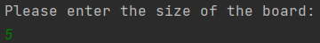
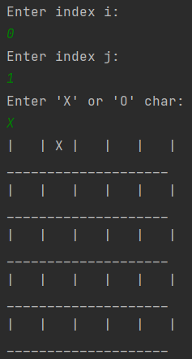
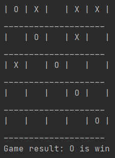

## Tic-Tac-Toe Java Game
### <i>By Kfir Goldfarb</i>
This project is a dynamic tic-tac-toe game build with java, running on the console.

## <i>Playing the game:</i>
first enter the size of the board:

choose the indexes in the board for entering the char 'X' or 'O':

when 'X' or 'O' is win the output will be:

